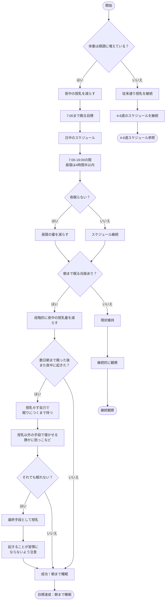
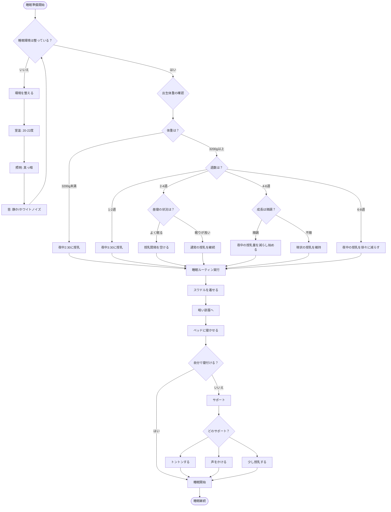
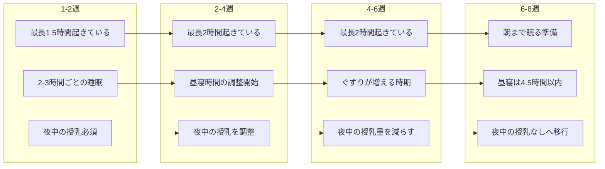

# ネントレスケジュール UMLアクティビティ図

## 1-2週のスケジュール

```mermaid
flowchart TD
    Start([開始]) --> Wake7[7:00 起床]
    Wake7 --> Diaper1[おむつ替え]
    Diaper1 --> Feed1[授乳]
    Feed1 --> Note1[/8時以降の授乳を控える/]
    Note1 --> Play1[最長1時間半起きている<br/>プレイマットで遊ぶ]
    
    Play1 --> Check815[8:15 おむつ確認]
    Check815 --> Clean1[身体を拭く]
    Clean1 --> Cream1[クリームを塗る]
    Cream1 --> Swaddle1[スワドルを着させる]
    Swaddle1 --> Sleep830[8:30 寝かせる]
    
    Sleep830 --> Wake945[9:45 スワドルを脱がせる]
    Wake945 --> Wait1[自然に目を覚ますのを待つ]
    Wait1 --> Wake10[10:00 起床]
    Wake10 --> Diaper2[おむつ替え]
    Diaper2 --> Feed2[授乳]
    Feed2 --> Clean2[身体を拭く]
    Clean2 --> PlayMat1[プレイマットに置く]
    
    PlayMat1 --> Check11[11:00 おむつ確認]
    Check11 --> Feed3[授乳]
    Feed3 --> Swaddle2[スワドルを着させる]
    Swaddle2 --> Sleep1130[11:30 寝かせる]
    
    Sleep1130 --> Decision1{自分で寝付ける？}
    Decision1 -->|はい| LongSleep1[2.5-3時間睡眠]
    Decision1 -->|いいえ| ExtraFeed1[少し授乳する]
    ExtraFeed1 --> LongSleep1
    
    LongSleep1 --> Wake14[14:00 スワドルを脱がせる]
    Wake14 --> Wait2[自然に目を覚ますのを待つ]
    Wait2 --> Wake1430[14:30 起床]
    Wake1430 --> Diaper3[おむつ替え]
    Diaper3 --> Feed4[授乳]
    Feed4 --> Note2[/15:15以降の授乳はしない/]
    Note2 --> KeepAwake[15:30まで寝かせない]
    
    KeepAwake --> Check1515[15:15 おむつ確認]
    Check1515 --> Swaddle3[スワドルを着させる]
    Swaddle3 --> Sleep1530[15:30 寝かせる]
    Sleep1530 --> Nap1[最長1時間半のお昼寝<br/>または散歩]
    
    Nap1 --> Wake1630[16:30 スワドルを脱がせる]
    Wake1630 --> Wait3[自然に目を覚ますのを待つ]
    Wait3 --> Wake17[17:00 起床]
    Wake17 --> Diaper4[おむつ替え]
    Diaper4 --> Feed5[授乳]
    Feed5 --> BathPrep[お風呂の準備]
    
    BathPrep --> Bath[17:30 お風呂に入れる]
    Bath --> BathEnd[18:00 お風呂からあがる]
    BathEnd --> Cream2[クリームを塗る]
    Cream2 --> Massage[マッサージをする]
    Massage --> Pajama[パジャマを着させる]
    
    Pajama --> Feed6[18:15 授乳]
    Feed6 --> Note3[/薄暗く静かな部屋で/]
    Note3 --> Swaddle4[スワドルを着させる]
    Swaddle4 --> Sleep19[19:00 寝かせる]
    
    Sleep19 --> Decision2{自分で寝付ける？}
    Decision2 -->|はい| NightSleep1[夜の睡眠]
    Decision2 -->|いいえ| ExtraFeed2[少し授乳する]
    ExtraFeed2 --> NightSleep1
    
    NightSleep1 --> Wake2145[21:45 スワドルを脱がせる]
    Wake2145 --> Wait4[自然に目を覚ますのを待つ]
    Wait4 --> Wake22[22:00 起床]
    Wake22 --> Diaper5[おむつ替え]
    Diaper5 --> Feed7[授乳]
    Feed7 --> Swaddle5[23:00 スワドルを着させる]
    Swaddle5 --> NightSleep2[寝かせる]
    
    NightSleep2 --> WeightCheck{出生体重は？}
    WeightCheck -->|3200g未満| Feed230[2:30 授乳]
    WeightCheck -->|3200g以上| Feed330[3:30 授乳]
    Feed230 --> End([終了/翌朝へ])
    Feed330 --> End
```

## 2-4週のスケジュール

```mermaid
flowchart TD
    Start([開始]) --> Wake7[7:00 起床]
    Wake7 --> Routine1[おむつ替え → 授乳]
    Routine1 --> Note1[/8時以降の授乳を控える<br/>最長2時間起きている/]
    
    Note1 --> Check830[8:30 おむつ確認]
    Check830 --> PrepSleep1[身体を拭く → クリーム → スワドル]
    PrepSleep1 --> Sleep9[9:00 寝かせる<br/>最長1時間半]
    
    Sleep9 --> Wake945[9:45 スワドルを脱がせる]
    Wake945 --> Wake10[10:00 起床]
    Wake10 --> Routine2[おむつ替え → 授乳]
    Routine2 --> Play1[身体を拭く → プレイマット]
    
    Play1 --> Check1130[11:30 おむつ確認]
    Check1130 --> Feed1130[授乳 → スワドル]
    Feed1130 --> Sleep12[12:00 寝かせる<br/>最長2時間半]
    
    Sleep12 --> Decision1{朝寝で1.5時間寝た？}
    Decision1 -->|はい| LimitSleep[2時間に抑える]
    Decision1 -->|いいえ| FullSleep[2.5時間まで可]
    LimitSleep --> Wake14
    FullSleep --> Wake14[14:00 スワドルを脱がせる]
    
    Wake14 --> Wake1430[14:30 起床]
    Wake1430 --> Routine3[おむつ替え → 授乳]
    Routine3 --> Note2[/15:15以降の授乳はしない/]
    
    Note2 --> Decision2{昼寝はしっかりした？}
    Decision2 -->|いいえ| SplitNap[授乳後と16:30に<br/>20分ずつ寝かせる]
    Decision2 -->|はい| NoNap[16:00まで寝かさない]
    
    SplitNap --> PrepEvening
    NoNap --> PrepEvening[15:45 おむつ確認 → スワドル]
    
    PrepEvening --> Sleep16[16:00 寝かせる]
    Sleep16 --> Wake17[17:00 起床]
    Wake17 --> EveningRoutine[おむつ替え → 授乳<br/>お風呂の準備]
    
    EveningRoutine --> Bath[17:30 お風呂]
    Bath --> AfterBath[18:00 お風呂からあがる]
    AfterBath --> BedPrep[クリーム → マッサージ → パジャマ]
    
    BedPrep --> Feed18[18:15 授乳]
    Feed18 --> Note3[/薄暗く静かな部屋で/]
    Note3 --> Swaddle18[スワドルを着させる]
    Swaddle18 --> Sleep19[19:00 寝かせる]
    
    Sleep19 --> Decision3{自分で寝付ける？}
    Decision3 -->|はい| NightSleep
    Decision3 -->|いいえ| ExtraFeed[少し授乳する]
    ExtraFeed --> NightSleep[夜の睡眠]
    
    NightSleep --> Wake2145[21:45 スワドルを脱がせる]
    Wake2145 --> Wake22[22:00 起床]
    Wake22 --> NightRoutine[おむつ替え → 授乳]
    NightRoutine --> Sleep23[23:00 スワドル → 寝かせる]
    
    Sleep23 --> NightFeeding[夜中の授乳<br/>目を覚ました時間に対応]
    NightFeeding --> End([終了/翌朝へ])
```

## 4-6週のスケジュール

```mermaid
flowchart TD
    Start([開始]) --> Wake7[7:00 起床]
    Wake7 --> Routine1[おむつ替え → 授乳]
    Routine1 --> Note1[/8時以降の授乳を控える<br/>最長2時間起きている/]
    
    Note1 --> Check830[8:30 おむつ確認]
    Check830 --> PrepSleep1[身体を拭く → クリーム → スワドル]
    PrepSleep1 --> Sleep9[9:00 寝かせる<br/>最長1時間]
    
    Sleep9 --> Wake945[9:45 スワドルを脱がせる]
    Wake945 --> Wake10[10:00 起床]
    Wake10 --> Diaper10[おむつ替え]
    Diaper10 --> Clean10[身体を拭く]
    Clean10 --> Feed1030[10:30 授乳]
    Feed1030 --> Play10[プレイマットに置く]
    
    Play10 --> Check1145[11:45 おむつ確認]
    Check1145 --> Swaddle1145[スワドルを着させる]
    Swaddle1145 --> Sleep12[12:00 寝かせる<br/>最長2時間半]
    
    Sleep12 --> Decision1{朝寝で1時間寝た？}
    Decision1 -->|はい| LimitSleep[2時間に抑える]
    Decision1 -->|いいえ| FullSleep[2.5時間まで可]
    
    LimitSleep --> Wake14
    FullSleep --> Wake14[14:00 スワドルを脱がせる]
    
    Wake14 --> Wake1430[14:30 起床]
    Wake1430 --> Routine1430[おむつ替え → 授乳]
    Routine1430 --> Note2[/15:15以降の授乳はしない<br/>16:15までは寝かせない/]
    
    Note2 --> Check16[16:00 おむつ確認]
    Check16 --> Swaddle16[スワドルを着させる]
    Swaddle16 --> Sleep1615[16:15 寝かせる]
    
    Sleep1615 --> Wake17[17:00 起床]
    Wake17 --> EveningRoutine[おむつ替え → 授乳<br/>お風呂の準備]
    
    EveningRoutine --> Bath[17:30 お風呂]
    Bath --> AfterBath[18:00 お風呂からあがる]
    AfterBath --> BedPrep[クリーム → マッサージ → パジャマ]
    
    BedPrep --> Feed18[18:15 授乳]
    Feed18 --> Note3[/薄暗く静かな部屋で/]
    Note3 --> Swaddle18[スワドルを着させる]
    Swaddle18 --> Sleep19[19:00 寝かせる]
    
    Sleep19 --> Decision3{自分で寝付ける？}
    Decision3 -->|はい| NightSleep
    Decision3 -->|いいえ| ExtraFeed[少し授乳する]
    ExtraFeed --> NightSleep[夜の睡眠]
    
    NightSleep --> Wake22[22:00 起床]
    Wake22 --> NightRoutine[おむつ替え → 授乳]
    NightRoutine --> Sleep23[23:00 スワドル → 寝かせる]
    
    Sleep23 --> NightDecision{起きた時間は？}
    NightDecision -->|4時前| FullFeed[全量授乳]
    NightDecision -->|4時以降| ReducedFeed[量を減らして授乳]
    
    FullFeed --> End([終了/翌朝へ])
    ReducedFeed --> End
    
    Note4[/この時期にぐずり始める<br/>17:00頃が最もぐずりやすい/] -.-> Sleep1615
```

## 6-8週のスケジュール

## 睡眠環境と条件の判断フロー

## 週数による発達の変化

## スケジュール実施時の重要ポイント

### 共通の原則
- **睡眠環境**：室温20-22度、真っ暗な部屋、静かな環境
- **ルーティン**：毎日同じ時間、同じ手順で実施
- **スワドル**：安心感を与え、モロー反射を防ぐ
- **段階的移行**：週数に応じて徐々に変化させる

### 週数別の注意点

| 週数 | 起きている時間 | 昼寝の合計 | 夜中の授乳 | 特記事項 |
|------|--------------|-----------|-----------|---------|
| 1-2週 | 最長1.5時間 | 制限なし | 体重により2:30/3:30 | 基本的な生活リズムの確立 |
| 2-4週 | 最長2時間 | 調整開始 | 起きた時に対応 | 授乳間隔を徐々に延ばす |
| 4-6週 | 最長2時間 | 状況により調整 | 量を減らし始める | ぐずりやすい時期、17時頃注意 |
| 6-8週 | 徐々に延長 | 4.5時間以内 | なしへ移行 | 朝まで眠る準備期間 |

### 判断基準のチェックリスト

#### 夜中の授乳を減らす判断基準
- [ ] 体重が順調に増えている（週170-226g）
- [ ] 22:00の授乳をしっかり飲んでいる
- [ ] 夜中の授乳を少量しか飲まない
- [ ] 朝7:00近くまでぐっすり眠っている

#### スケジュール調整の判断基準
- [ ] 自分で寝付けるようになってきた
- [ ] 昼寝の時間によく眠る
- [ ] 授乳のために起こさなければいけないことが多い
- [ ] 以前よりも目を覚ましている時間が長い
